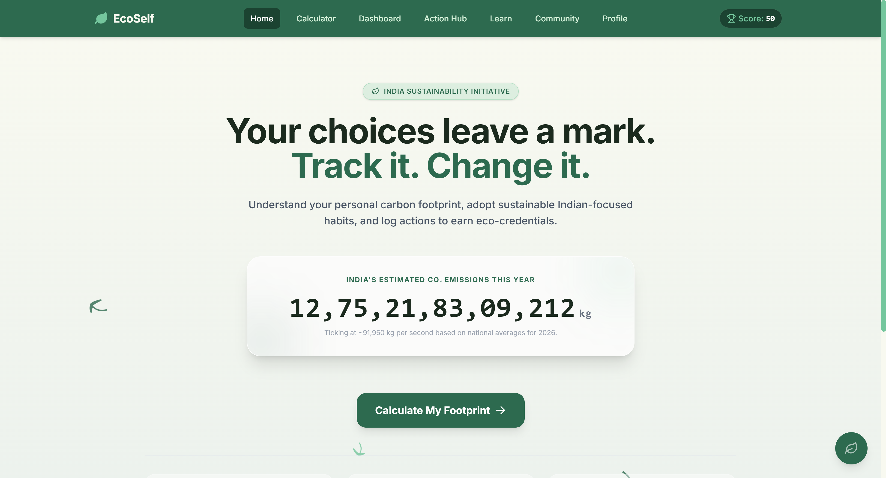
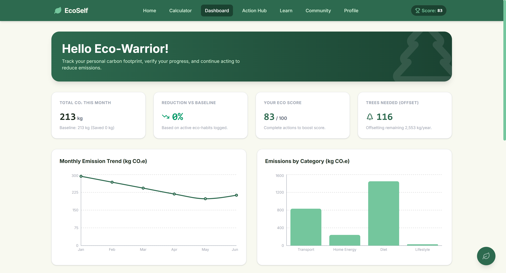
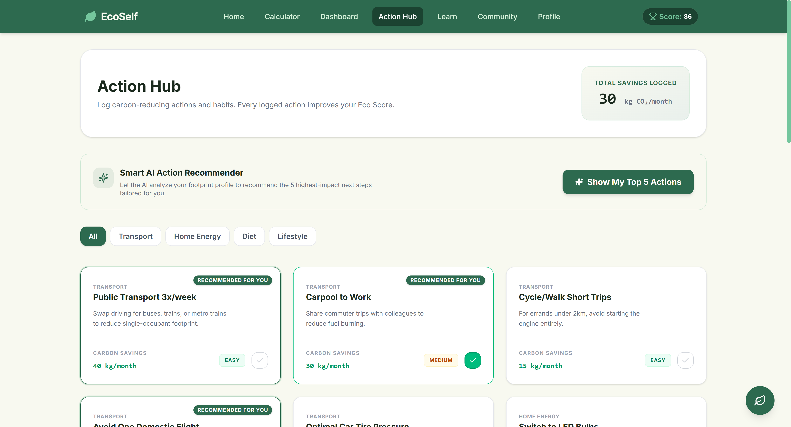
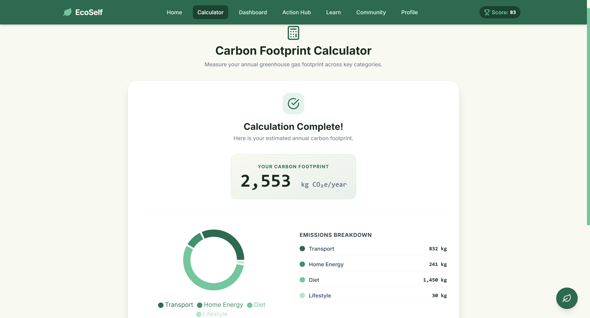
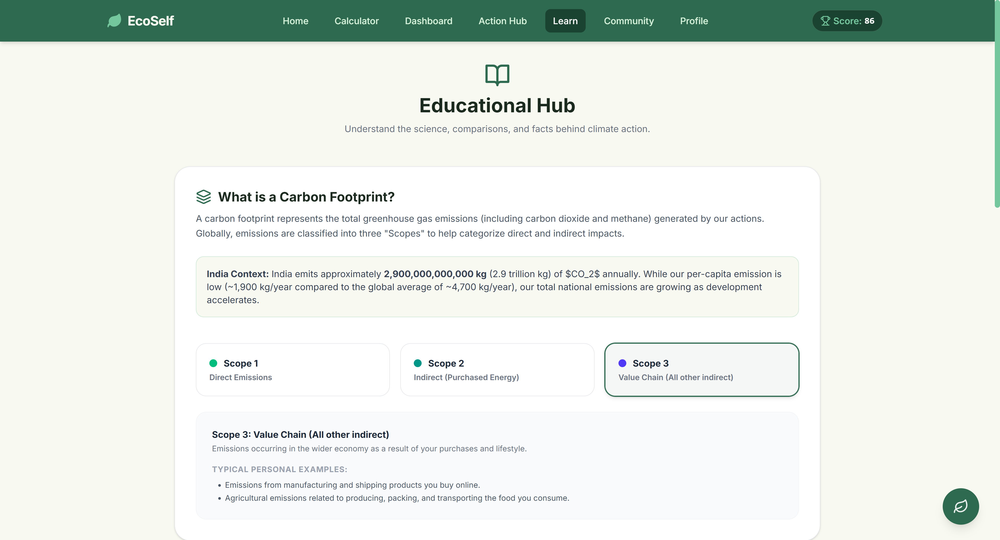
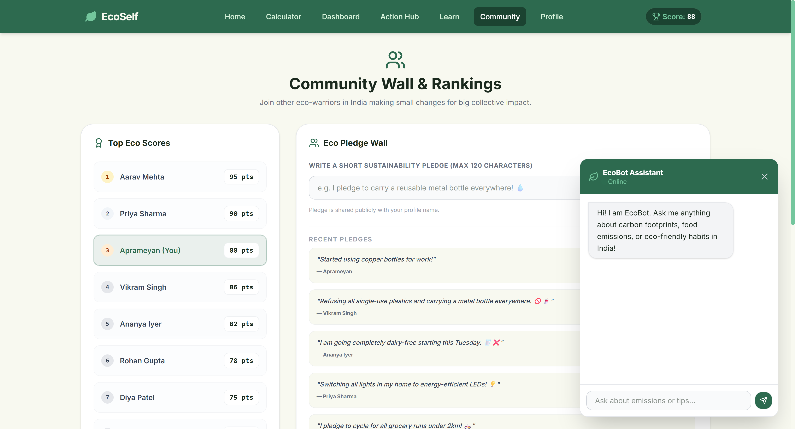

# EcoSelf 🌱

EcoSelf is a comprehensive, AI-powered Carbon Footprint Awareness Platform designed specifically for individual users in India. The application helps users understand, track, and actively reduce their personal carbon footprint through simple everyday actions, local insights, community pledges, and AI-driven recommendations.

---

## 🎯 Challenge Vertical
**[Challenge 3] Carbon Footprint Awareness Platform** — Hack2Skill × Google PromptWars India 2026
 
---
 
## 🧠 Approach & Logic
 
EcoSelf is built around three core principles:
 
1. **Client-side calculations for instant feedback** — All carbon math runs in the browser using `calculateFootprint.js` with IPCC AR6 emission factors. No round-trip to a server means results appear instantly after the 4-step wizard.
2. **Persistence without authentication** — User profile, completed actions, and footprint history are stored in `localStorage`. This keeps the app friction-free (no sign-up required) while maintaining state across sessions.
3. **AI as advisor, not gimmick** — Four Gemini-powered features (Eco Advisor, Action Recommender, EcoBot Chatbot, Weekly Report) are each independently failable. If Gemini is unavailable, every feature has a real algorithmic fallback — not a placeholder error.
4. **India-first data** — Emission factors use CEA India's grid intensity (0.82 kg CO₂e/kWh), ₹7/kWh average electricity tariff, and LPG cylinder specs specific to India's 14.2 kg standard cylinder.
---
 
## 🔄 How It Works
 
1. **Calculate** — User completes a 4-step form (Transport → Home Energy → Diet → Lifestyle). Results show as a donut chart breakdown in kg CO₂e/year.
2. **Track** — Dashboard shows monthly trend, category breakdown bar chart, and comparison against India average (1,900 kg/year) and global average (4,700 kg/year).
3. **Reduce** — Action Hub lists 20 eco-actions with CO₂ savings. AI recommends the 5 highest-impact next steps based on the user's specific footprint profile.
4. **Learn** — Educational hub covers Scope 1/2/3 emissions, 8 India-specific comparison facts, and a 6-question climate science FAQ.
5. **Community** — Pledge wall (SQLite-backed), leaderboard with live Eco Score sync, rotating weekly challenge, and a pre-filled Twitter/X share button.
6. **Profile** — Badge system (4 tiers), score sparkline, text report export, and AI-generated weekly sustainability report via modal.
---
 
## 📌 Assumptions Made
 
- Electricity tariff assumed at **₹7.00/kWh** (national average across residential tariff slabs; actual rates vary by state and DISCOM).
- Public transport emission factor is **0.05 kg CO₂e per passenger-hour** (weighted average of Indian city bus and metro systems; not per km, as trip distances vary widely).
- Domestic flight average distance assumed **~1,000 km** per flight; international average **~4,000 km** per flight.
- Diet emission values are **annual totals** (kg CO₂e/person/year) based on IPCC AR6 Table 7.1 food system emissions, adjusted for Indian dietary patterns.
- LPG cylinder assumed to be the standard **14.2 kg Indian cylinder** (BPL/domestic category).
- Household electricity and cooking emissions are divided equally by household size to derive per-capita figures.
- Mock leaderboard data (Aarav Mehta, Priya Sharma, etc.) is seeded on first DB initialization to demonstrate community features.
- Monthly CO₂ figures on the Dashboard are derived by dividing annual calculator results by 12.
---
 
## 🖼️ Screenshots
 
<!-- Add your screenshots here after uploading to the repo -->
<!-- Suggested: add a /screenshots folder to your repo and reference like below -->
 
| Home | Dashboard | Action Hub |
|------|-----------|------------|
|  |  |  |
 
| Calculator | Learn | Community |
|------------|-------|-----------|
|  |  |  |
 
---
 
## 🚀 Live Demo
<!-- Add your deployed URL here if available -->
> Coming soon / [Deploy instructions below](#-getting-started)
 
---

## 🚀 Getting Started

### 1. Prerequisites
- **Node.js**: v18.0.0 or higher (Tested on Node.js v24.13.0)
- **NPM**: v9 or higher

### 2. Installation
To install dependencies for the root, client, and server, run the following command from the root `ecoself` directory:
```bash
npm run install-all
```

### 3. Setting up the Gemini API Key
To enable the AI Eco Advisor, Smart Action Recommender, EcoBot Chatbot, and Weekly Eco Report Generator:
1. Go to [Google AI Studio](https://aistudio.google.com/) and sign in with your Google account.
2. Click on **Get API Key** and create a new API key.
3. In the `/server` folder, copy `.env.example` to `.env`:
   ```bash
   cp server/.env.example server/.env
   ```
4. Edit `server/.env` and paste your Gemini API key:
   ```env
   PORT=5000
   GEMINI_API_KEY=your_gemini_api_key_here
   ```

### 4. Running the Application
To run the server and client concurrently in development mode, run:
```bash
npm run dev
```
- **Frontend** runs on: `http://localhost:5173`
- **Backend API** runs on: `http://localhost:5000`

---

## 🧮 Carbon Footprint Calculation Methodology

All calculations are executed in kilograms of $CO_2$ equivalent ($kg\ CO_2e$) per year to maximize psychological immediacy and drive behavioural change.

### Emission Factors (Based on IPCC AR6 & Central Electricity Authority India)

1. **Transport**:
   - **Petrol Car**: $0.18\ kg\ CO_2e/km$
   - **Diesel Car**: $0.20\ kg\ CO_2e/km$
   - **Electric Car**: $0.10\ kg\ CO_2e/km$ (reflections of coal-heavy Indian power grid)
   - **Petrol Two-wheeler**: $0.08\ kg\ CO_2e/km$
   - **Electric Two-wheeler**: $0.04\ kg\ CO_2e/km$
   - **Domestic Flights**: $0.12\ kg\ CO_2e/km$ (assumed average ~1,000 km per trip)
   - **International Flights**: $0.11\ kg\ CO_2e/km$ (assumed average ~4,000 km per trip)
   - **Public Transport (Bus/Metro)**: $0.05\ kg\ CO_2e/hour$

2. **Home Energy**:
   - **Electricity**: $0.82\ kg\ CO_2e/kWh$ (Source: Central Electricity Authority of India - CO2 Baseline Database for the Indian Power Sector).
     - *Formula*: $kWh/year = (\text{Monthly Bill in } \text{INR} \div \text{INR } 7.00\text{ average rate}) \times 12$
     - *Per Capita Split*: The total energy footprint of the household is divided by the household size to obtain the user's per-capita emission.
   - **LPG Cooking Gas**: $42.5\ kg\ CO_2e/cylinder$ (14.2 kg cylinder at $3.0\ kg\ CO_2e$ per kg LPG)
   - **PNG**: $20.0\ kg\ CO_2e/month$ (average cooking emissions)
   - **Induction**: Modeled via electricity consumption ($10.0\ kg\ CO_2e/month$ per capita equivalent)

3. **Diet**:
   - **Vegan**: $1,000\ kg\ CO_2e/year$
   - **Vegetarian**: $1,400\ kg\ CO_2e/year$
   - **Occasional Meat**: $2,000\ kg\ CO_2e/year$
   - **Regular Meat**: $2,800\ kg\ CO_2e/year$
   - **Food Waste**: Low ($50\ kg$), Medium ($150\ kg$), High ($300\ kg$) per year.

4. **Lifestyle**:
   - **Online Shopping**: $1.5\ kg\ CO_2e/order$ (packaging, logistics, and delivery)
   - **Streaming**: $0.05\ kg\ CO_2e/hour$ (data centre and transmission overheads)
   - **Single-use Plastics**: Rarely ($10\ kg$), Sometimes ($30\ kg$), Often ($80\ kg$) per year.

---

## 🛡️ Database & Security Features
- **Database Safety Fallback**: Primarily attempts to use `better-sqlite3`. If installation fails on Windows, it catches the error and stores data in a thread-safe, in-memory JS store, preventing server crashes.
- **XSS Protection**: Submissions to the Community Pledge Wall are stripped of all HTML tag structures (`replace(/<[^>]*>/g, '')`) and trimmed, ensuring safe rendering.
- **API Guardrails**: The chatbot system prompt is hardcoded to redirect user messages strictly back to sustainability and carbon footprint topics if off-topic requests are detected.
- **HTTP Security Headers**: helmet.js middleware enforces X-Frame-Options: DENY, X-Content-Type-Options: nosniff, Strict-Transport-Security, and 8 other OWASP-recommended headers on all server responses.
- **Rate Limiting**: The pledge wall POST endpoint is rate-limited to 3 requests per minute per IP address using express-rate-limit, preventing spam and abuse.
